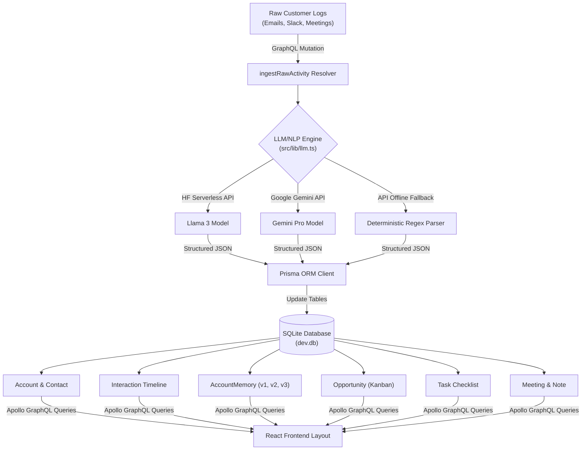

# ⚡ Lightfield CRM Core Sandbox  
https://lightfield-core-sandbox-1.onrender.com

<div align="center">
  
  [](https://nextjs.org/)
  [](https://www.apollographql.com/)
  [](https://prisma.io/)
  [](https://sqlite.org/)
  [](https://www.docker.com/)

  **A self-assembling, AI-native CRM developer sandbox modeled on Lightfield’s core concepts.**
  
  *Automate customer interaction capture, versioned company memory compilation, and pipeline opportunities extraction without manual forms or fields.*
</div>

---

## 📐 System Architecture Blueprint

The following blueprint maps the data flow from unstructured touchpoint ingestion to database records, AI memory consolidation, and client-side presentation:



---

## 🌟 Core Feature Walkthrough

### 📥 1. Unstructured CRM Ingestor
Paste raw, messy communication logs. The sandbox runs it through the AI extraction engine:
*   **Company Detection:** Finds or generates the target `Account`.
*   **Contact Parser:** Identifies the sender, email address, and job title to build a profile directory.
*   **Checklist Generator:** Auto-extracts tasks (e.g. *"send compliance paperwork by Thursday"*) and logs them.
*   *Mock Templates:* Features Vercel, Stripe, and Figma simulation presets to populate the sandbox with mock logs.

<details>
<summary><b>🔍 View parser logic highlights</b></summary>

The engine uses a helper `parseBudget` to capture deal sizing sentences (e.g., *"$50,000 for licenses"* or *"$30k"*) and populate the Kanban board:
```typescript
export function parseBudget(text: string): number {
  const clean = text.toLowerCase();
  const kPattern = /\$?(\d+(?:\.\d+)?)\s*k\b/;
  const matchK = clean.match(kPattern);
  if (matchK) return parseFloat(matchK[1]) * 1000;

  const standardPattern = /\$?(\d{1,3}(?:,\d{3})+|\d+)/;
  const matchStd = clean.match(standardPattern);
  if (matchStd) return parseFloat(matchStd[1].replace(/,/g, ''));

  return 0.0;
}
```
</details>

---

### 📋 2. Opportunities Kanban Board
*   **6-Stage Sales Pipeline:** Columns mapping `Lead`, `Contacted`, `Demo`, `Proposal`, `Won`, and `Lost`.
*   **Automated Valuation:** Automatically sums pipeline deal values per stage and displays total pipeline metrics.
*   **Stage Mutator:** Shifting controls (arrow buttons + dropdown stage selector) that dynamically sync database records in the backend.

---

### 🧠 3. Versioned Memory Hub
*   **Chronological Log Timelines:** Scrollable list of touchpoints (emails, meetings, notes) linked to each account.
*   **Memory Version Slider (`v1`, `v2`, `v3`):** Simulates a core Lightfield concept. As new conversations are ingested, the AI compiles a new versioned summary. Users can slide historical versions to view compiled changes over time.

---

### 💬 4. Grounded AI Assistant (Chat)
*   **Semantic Queries:** Ask questions in plain English (e.g. *"Any requests for custom pricing?"*).
*   **Reasoning Logs:** Renders real-time trace outputs of the agent's logic steps.
*   **Grounded Citations:** Renders citation cards linking back to direct database transaction ids.

---

### ⚙️ 5. HubSpot Migrator Console
*   **CSV Sync Simulator:** Paste tabular database CSV outputs.
*   **Log Console:** Renders an animated code terminal simulation, displaying progress outputs of imports, account matching, contact generation, and database insertions.

---

### 🗃️ 6. Core CRM Resources
*   **Contacts:** Directory table of profile cards with a manual contact creator.
*   **Action Items:** Task checklist with filter tabs (All, Pending, Completed) and checkmark toggles.
*   **Meetings:** Transcript timeline logger with a dark-theme code log viewer.
*   **Notes:** Quick sticky-note annotation cards tagged by company.

---

## 🏃 Local Quickstart

### 1. Pre-requisites
Ensure you have **Node.js (v20+)** installed.

### 2. Installation
```bash
git clone git@github.com:Tejal-Bhavsar/lightfield-core-sandbox.git
cd lightfield-core-sandbox
npm install
```

### 3. Database Initialization
```bash
npx prisma migrate dev --name init
```

### 4. Configure Keys (Optional)
Create a `.env` file in the root folder:
```text
DATABASE_URL="file:./dev.db"

# LLM Configurations
LLM_PROVIDER="huggingface" # Options: "huggingface" or "gemini"
HF_API_TOKEN="your_hf_token_here"
GEMINI_API_KEY="your_gemini_key_here"
```
*Note: If environment keys are missing, the system gracefully falls back to the offline regex parser.*

### 5. Launch
```bash
npm run dev
```
Open `http://localhost:3000` to launch the portfolio landing page, and click **Enter Developer Sandbox** to access the console.

---

## 🐳 Docker Deployment

The application includes an optimized multi-stage build container setup:

```bash
# Build the Docker container
docker build -t lightfield-crm-sandbox .

# Start the container
docker run -p 3000:3000 lightfield-crm-sandbox
```
Prisma migrations deploy automatically at launch. The container compiles the standalone Next.js production build, available at `http://localhost:3000`.

---

## 👤 Creator Spotlight

*   **Author:** Tejal Bhavsar
*   **Education:** MS in AI & Data Science (UMBC) — Thesis focusing on RAG, Vector Embeddings, and Semantic Search.
*   **Background:** 4+ years of Full-stack Software Engineering (e-Zest, Tradecred, Globant).
*   **Hiring Goal:** AI Product Engineer, New Grad role at Lightfield.
*   **Contact:** (667)-445-7208 | sdetejal@gmail.com | [LinkedIn](https://www.linkedin.com/in/hi-tejal-here/)
